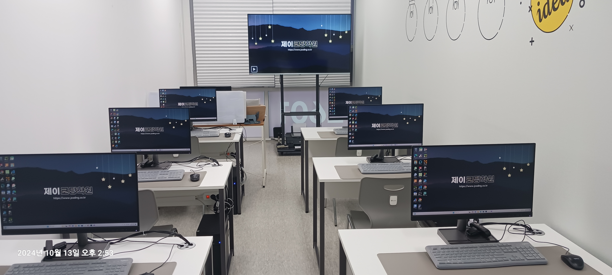

# 제이코딩학원

- 수강대상 : 초등부 / 중고등부 / 대학성인부
- EPL : 스크래치주니어, 스크래치, 엔트리, 피지컬코딩(아두이노, 마이크로비트, 코드위즈), 로봇(카미봇파이)
- 텍스트코딩 : C, C++, Python
- Linux, DataBase
- 자격증과정 : YBMIT COS / COS Pro, 정보처리기사, 리눅스마스터 1/1급, 네트워크관리사 2급, SQLD 등

- 주소: 인천광역시 연수구 해돋이로 152번길 35 퍼스트프라자 5층 502호
- 상담문의: 0507 - 1463 - 2601
